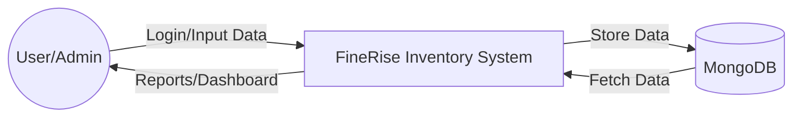
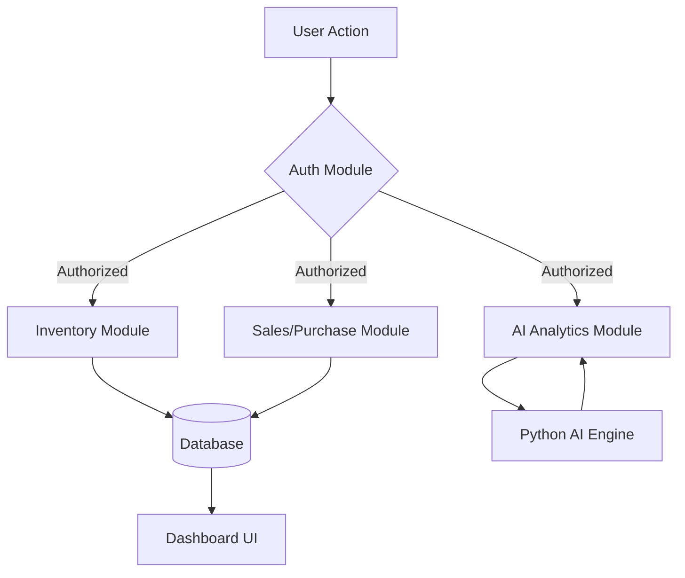

# FineRise Inventory Management System - PRD

## Chapter 1: Introduction
The **FineRise Inventory Management System** is a state-of-the-art, MERN-stack-powered application designed to revolutionize how businesses manage their stock, sales, and procurement. Unlike traditional record-keeping systems, FineRise focuses on **Strategic Asset Management**, bridging the gap between raw data and actionable intelligence through real-time synchronization and predictive analytics.

### Objectives:
*   To provide a centralized platform for managing multiple stores and products.
*   To automate inventory tracking (Sales and Purchases) with high precision.
*   To deliver predictive insights using integrated AI for forecasting.
*   To offer a premium, modern user experience that reduces operational overhead.

---

## Chapter 2: Hardware and Software Requirements

### Hardware Requirements:
*   **Processor**: 1.6 GHz or faster (Dual-core minimum).
*   **RAM**: 4 GB or higher.
*   **Storage**: 500 MB of available space for application and local caching.
*   **Display**: 1280 x 800 minimum resolution.

### Software Requirements:
*   **Operating System**: Windows 10/11, macOS, or Linux.
*   **Runtime**: Node.js (v16.x or higher).
*   **Database**: MongoDB (Local or Atlas).
*   **Browser**: Chrome, Firefox, Edge, or Safari (Latest versions).
*   **Development Tools**: VS Code, Git, Postman.

---

## Chapter 3: Feasibility Study

### Technical Feasibility:
The project utilizes the MERN stack (MongoDB, Express, React, Node.js), which is highly scalable and well-documented. The integration of Python for AI analytics is achieved through RESTful communication, making the advanced forecasting features technically viable.

### Economic Feasibility:
FineRise reduces manual data entry errors and optimizes stock levels, potentially saving businesses significant costs associated with overstocking or stockouts. The open-source nature of the core stack keeps development costs manageable.

### Operational Feasibility:
With its intuitive panel-driven architecture and glassmorphism-inspired UI, the system requires minimal training for users. It automates complex metrics like Turnover Rate and Profit Margins, making it highly operational for business owners.

---

## Chapter 4: System Analysis

### Existing System Drawbacks:
*   **Manual Entry**: High risk of human error.
*   **Delayed Updates**: No real-time synchronization between sales and stock.
*   **Static Reporting**: Inability to visualize trends or perform predictive analysis.
*   **Fragmentation**: Disconnected data across different store locations.

### Proposed System (FineRise):
*   **Real-time Sync**: Instant updates across all modules.
*   **Predictive Intelligence**: Sales forecasting using AI.
*   **Centralized Control**: Single dashboard for multiple stores.
*   **Automated Metrics**: Automatic calculation of key performance indicators (KPIs).

---

## Chapter 5: Technology Used with Feature Details

### Technology Stack:
*   **Frontend**: React.js, Framer Motion (Animations), ApexCharts (Data Viz), Tailwind CSS.
*   **Backend**: Node.js, Express.js.
*   **Database**: MongoDB with Mongoose ODM.
*   **AI Engine**: Python (Statistical modeling for forecasting).
*   **Security**: Bcrypt.js (Password hashing), JWT (Authentication).

### Key Features:
1.  **Dashboard**: Interactive analytics for sales and purchase trends.
2.  **Product Management**: Full CRUD operations for inventory items.
3.  **Store Oversight**: Linking products to specific store locations.
4.  **Transaction Tracking**: Automated stock adjustments based on sales/purchases.
5.  **AI Insights**: Predictive stock level and demand forecasting.

---

## Chapter 6: Software Process Model
The project follows the **Agile Methodology**. This allows for iterative development, frequent testing, and the flexibility to incorporate user feedback throughout the development lifecycle. Sprints focus on specific modules (Auth, Inventory, Analytics) to ensure incremental delivery of high-quality features.

---

## Chapter 7: Design
The design philosophy of FineRise is centered around **Premium Aesthetics** and **Clarity**.

*   **UI Style**: Glassmorphism with deep navy and vibrant accent colors.
*   **Typography**: Clean, modern fonts (Inter/Roboto) for high readability.
*   **Layout**: Responsive grid system that adapts to Desktop and Tablet views.
*   **Navigation**: Persistent sidebar with intuitive iconography for quick access.

---

## Chapter 8: Data Flow Diagrams (DFD)

### Level 0 DFD (Context Diagram)


### Level 1 DFD (Module Flow)


---

## Chapter 9: Snapshots

````carousel

<!-- slide -->

<!-- slide -->

````

---

## Chapter 10: Testing
Testing is performed at multiple levels to ensure system stability:
*   **Unit Testing**: Individual components and utility functions are tested using **Jest**.
*   **Integration Testing**: API endpoints are tested to ensure proper communication between Node.js and MongoDB.
*   **UI Testing**: React Testing Library is used to verify component rendering and user interactions.
*   **User Acceptance Testing (UAT)**: Validating features against business requirements to ensure accuracy in inventory counts.

---

## Chapter 11: Implementation
1.  **Environment Setup**: Installing Node.js, MongoDB, and Python dependencies.
2.  **Database Modeling**: Designing Mongoose schemas for Users, Products, Stores, and Transactions.
3.  **API Development**: Building RESTful routes for all inventory operations.
4.  **Frontend Integration**: Connecting the React UI to the Backend using Axios/Fetch.
5.  **AI Integration**: Setting up the Python service for data processing and forecasting.

---

## Chapter 12: Maintenance
Maintenance involves:
*   **Performance Tuning**: Optimizing database queries and frontend rendering.
*   **Security Updates**: Keeping dependencies up-to-date and auditing authentication flows.
*   **Bug Fixes**: Addressing issues reported during production usage.
*   **Scalability**: Upgrading infrastructure as the volume of data grows.

---

## Chapter 13: Conclusion
FineRise transforms traditional record-keeping into a **Strategic Asset Management** engine. By bridging the gap between raw data and actionable intelligence, it provides businesses with the tools needed to thrive in a data-driven market. The system's intuitive architecture and predictive capabilities ensure that inventory is no longer a challenge, but a competitive advantage.

### Future Scope:
*   **Mobile App**: Dedicated iOS/Android versions.
*   **Barcode Integration**: QR/Barcode scanning for instant entry.
*   **Supplier Portal**: Automated re-ordering with vendor integration.
*   **Advanced ML**: Multi-year seasonal trend analysis.
